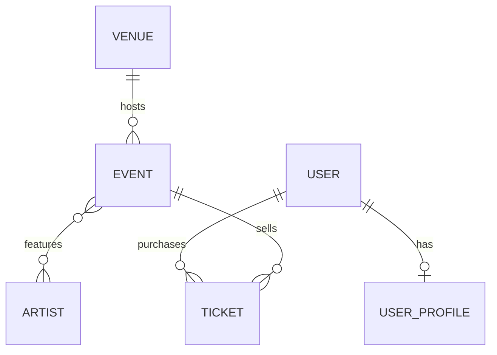

Taller de PulsePass
Proyecto académico de la capa de persistencia de una plataforma de eventos, artistas y entradas.
Incluye el modelo relacional, las migraciones con Flyway, las entidades JPA, los repositories de
Spring Data y las pruebas de integración contra un PostgreSQL real.

Miembros del grupo: 
-Juan Arias
-Martin Soto 
Grupo: 3

Se utilizó:

- Java 21
- Spring Boot 4 con Spring Data JPA (Hibernate)
- PostgreSQL 16
- Flyway para versionar el esquema
- Testcontainers para las pruebas
- Maven

Requisitos para ejecutar 

- JDK 21
- Maven 3.9 o superior
- Docker en ejecución (lo necesitan las pruebas, porque Testcontainers levanta PostgreSQL solo)
No hace falta instalar PostgreSQL

Cómo ejecutar

Correr las pruebas:

```bash
mvn clean test
```

Correr la aplicación con una base de datos local (opcional):

```bash
docker compose up -d
mvn spring-boot:run
```

Al arrancar, Flyway crea las tablas y Hibernate solo las valida (ddl-auto=validate).

Las pruebas no usan H2 ni la base del docker-compose.yml. Cada ejecución levanta un contenedor postgres:16-alpine nuevo.

Estructura del proyecto

```
src/main/java/com/pulsepass
├── PulsePassApplication.java
├── domain
│   ├── enums        EventCategory, EventStatus, TicketType, TicketStatus
│   └── model        Venue, Event, Artist, User, UserProfile, Ticket
└── repository       un repository por entidad

src/main/resources
├── application.yml
└── db/migration     V1, V2 y V3

src/test/java/com/pulsepass
├── support          PostgresContainerConfig, AbstractPostgresIT, TestData
├── migration        FlywayMigrationIT
└── repository       VenuePersistenceTest, EventRepositoryIT, EventArtistIT,
                     UserProfileIT, TicketRepositoryIT, EventSearchIT
```

Modelo de datos



| Relación | Cómo la mapeamos |
|---|---|
| Venue 1:N Event | @ManyToOne en Event.venue (FK venue_id). Venue.events es el lado inverso con mappedBy. |
| Event N:M Artist | @ManyToMany con la tabla event_artists, que tiene PK compuesta (event_id, artist_id). Usamos Set para no repetir artistas. |
| User 1:1 UserProfile | La FK user_id de user_profiles es UNIQUE. Un usuario puede no tener perfil (BR-004 dice "como máximo uno"). |
| User 1:N Ticket y Event 1:N Ticket | Ticket tiene dos @ManyToOne (user_id y event_id), ambas NOT NULL. |

Decisiones que tomamos:

- Ticket es una entidad y no un @ManyToMany entre User y Event porque tiene datos propios
  (código, tipo, precio, estado y fecha de compra).
- Los enums se guardan con EnumType.STRING. Con ORDINAL, cambiar el orden del enum dañaría los datos ya guardados. Además cada columna tiene un CHECK con los valores permitidos.
- El precio es BigDecimal en Java y NUMERIC(12,2) en la base, para evitar errores de redondeo.
- equals y hashCode usan la clave de negocio (code, eventCode, stageName, etc.) porque el
  id es null hasta que se guarda.
- No usamos Lombok en las entidades.
- La tabla se llama users porque user es palabra reservada en PostgreSQL.

## Migraciones

| Archivo | Qué hace |
|---|---|
| V1__create_schema.sql | Crea las 7 tablas con sus PK, FK, UNIQUE, CHECK e índices. |
| V2__insert_initial_artists.sql | Inserta a Solar Beat, Neon Waves, Caribbean Sound, Ocean Drive y Digital Pulse. |
| V3__add_streaming_url_to_event.sql | Agrega streaming_url VARCHAR(500) (nullable) a events. |

Restricciones que aplica PostgreSQL:

| Regla | Restricción |
|---|---|
| Códigos e identidades únicos | uq_venues_code, uq_events_event_code, uq_artists_stage_name, uq_users_username, uq_users_email, uq_tickets_ticket_code |
| Capacidad mayor que 0 | ck_venues_capacity |
| Precio mayor o igual a 0 | ck_tickets_price |
| Estados, categorías y tipos válidos | ck_events_category, ck_events_status, ck_tickets_type, ck_tickets_status |
| Un solo perfil por usuario | uq_user_profiles_user |
| Sin pares evento-artista repetidos | PK compuesta en event_artists |
| Ticket con usuario y evento reales | FK y NOT NULL en user_id y event_id |

Una migración que ya se aplicó no se edita. Los cambios nuevos van en una versión nueva (V4, V5...).

 Consultas

| Necesidad | Método | Tipo |
|---|---|---|
| Evento por eventCode | findByEventCode | Query Method |
| Eventos publicados por fecha | findByStatusOrderByEventDateAsc | Query Method |
| Eventos de un venue por código | findByVenueCode | Query Method (navega venue.code) |
| Usuario por email sin importar mayúsculas | findByEmailIgnoreCase | Query Method |
| Tickets de un usuario por email y estado | findByUserEmailIgnoreCaseAndStatus | Query Method |
| Tickets PAID de un evento | findByEventEventCodeAndStatus | Query Method |
| Eventos por artista | findByArtistStageName | JPQL con JOIN |
| Eventos por ciudad y artista | findByCityAndArtist | JPQL con JOIN |
| Eventos recomendados | findRecommended | JPQL con DISTINCT y ORDER BY |
| Cantidad de tickets PAID | countPaidByEventCode | JPQL con COUNT |
| Tickets de eventos futuros | findForEventsAfter | JPQL con JOIN y ORDER BY |

Usamos Query Method cuando el nombre del método alcanza para entender la consulta. Usamos JPQL
cuando hay JOIN explícito, DISTINCT, COUNT o varias relaciones. No usamos SQL nativo.

Para los tickets PAID de un evento elegimos Query Method porque son solo dos condiciones de igualdad.

Pruebas

| Clase | Qué prueba |
|---|---|
| FlywayMigrationIT | Que V1, V2 y V3 se apliquen desde una base vacía y que Hibernate solo valide. |
| VenuePersistenceTest | Venue: guardar, código único, capacidad válida y relación con eventos. |
| EventRepositoryIT` | Eventos: consulta por código, por venue, publicados en orden, enums y streaming_url. |
| EventArtistIT | Relación N:M, artistas repetidos y consulta por artista. |
| UserProfileIT | Relación 1:1, username y email únicos, segundo perfil rechazado. |
| TicketRepositoryIT | Tickets: relaciones, código único, precio, consultas y conteo de PAID. |
| EventSearchIT | Búsquedas por ciudad, artista y eventos recomendados. |

Cómo están hechas:

- Todas usan PostgreSQL real con un solo contenedor compartido (PostgresContainerConfig).
- Cada prueba corre en una transacción que se revierte al final.
- Antes de leer se llama a flushAndClear() para que los datos vengan de la base y no de la memoria
  de JPA.
- Las violaciones de restricciones van al final de cada prueba, porque PostgreSQL cancela la
  transacción después del primer error.

Respuestas a Preguntas

1. ¿Por qué Ticket es una entidad y no un
@ManyToMany?
Porque tiene atributos propios (código, tipo, precio, estado y fecha). Un @ManyToMany solo guarda
el par de ids y no puede llevarlos.

2. ¿Qué reglas van en PostgreSQL y cuáles en una capa Service?
En la base van las que nunca se pueden romper: unicidad, claves foráneas, NOT NULL, rangos y
catálogos. En un Service irían las que dependen de más contexto, como las transiciones de estado o
calcular cuándo un evento está SOLD_OUT.

3. ¿Qué consultas son Query Methods y cuáles JPQL?
Query Method para filtros simples o que navegan una relación. JPQL cuando hay JOIN, DISTINCT, COUNT o varias relaciones a la vez.

4. ¿Qué pasa si se modifica V1 después de aplicarla?
Flyway guarda un checksum de cada migración y falla al arrancar si el archivo cambió. Lo correcto
es crear una migración nueva.

5. ¿Qué diferencias podría ocultar H2?
H2 se comporta distinto a PostgreSQL en tipos, IDENTITY, CHECK y en los mensajes de error. Una
prueba puede pasar en H2 y fallar en PostgreSQL.

6. ¿Cómo evolucionaría el modelo para evitar sobreventa?
Con una tabla de inventario, por ejemplo TicketInventory(event, type, total, sold), que se
actualice en la misma transacción que crea el ticket, con bloqueo optimista (@Version) o un
UPDATE condicionado. También separando Order y Payment de Ticket.
